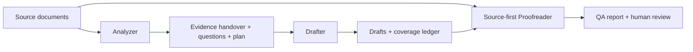

# Case study: Building a source-grounded AI documentation workflow

## The problem

A PRD can contain incomplete behavior, contradictory requirements, ambiguous UI paths, and unsupported assumptions. Directly asking an AI assistant to “write the docs” risks converting those uncertainties into confident instructions. A technical writer also needs traceability: what came from the source, what was deferred, and what was checked.

## The solution

I designed a reusable, docs-as-code workflow using four Agent Skills:

1. **Analyzer** inventories and reads source material, classifies claims as FACT / ASSUMPTION / INFERENCE / UNKNOWN / CONTRADICTION, and produces a structured evidence handover and content plan.
2. **Drafter** writes audience-specific documentation from supported claims and maintains a claim-to-document coverage ledger.
3. **Proofreader** rechecks drafts against the original sources and records PASS / WARNING / FAIL findings and readiness.
4. **Generate Docs** orchestrates the stages, including revised-source change-impact analysis.

The workflow uses Markdown templates, Python structural validation, and GitHub Actions. Human product verification and editorial approval remain necessary before publication.

## Evidence-based demonstrations

**Demo A : fictional Quiet Hours feature:** A sample PRD leaves the exact meaning of “Until tomorrow” undefined. The generated drafts avoid inventing a time or time zone; the clarification register preserves the gap. See [fictional PRD](demo/mock-prd.md) and [generated review](output/quiet-hours/qa/QA-REPORT.md).

**Demo B : source revision:** A revised fictional PRD changes the fixed duration from one hour to two hours and clarifies that manual resumption requires an online connection. The workflow records changed and unresolved claims, updates the affected documents, and preserves the previous output. See [revised PRD](demo/mock-prd-v2.md), [change-impact analysis](output/quiet-hours-v2/analysis/CHANGE-IMPACT.md), and [acceptance expectations](demo/revision-acceptance.md).

## Architecture

## Engineering decisions and trade-offs

- **Grounding over fluency:** When the source does not establish a UI action or result, the system omits or blocks the instruction instead of guessing.
- **Independent source review over self-consistency:** Proofreading checks the source, not merely agreement with the previous agent. A separate reviewer is preferred; a second pass must not be misrepresented as independent.
- **Auditability over minimal output:** The handover, questions, content plan, and coverage ledger create review overhead, but make decisions inspectable.
- **Deterministic checks plus human judgment:** The checker catches structure, references, and missing coverage entries; it cannot prove a technical statement is correct.
- **Change impact over blind regeneration:** The update mode compares old and new sources and preserves previous generated outputs.

## What has been demonstrated

- A reusable four-stage skill architecture with source classifications and structured artifacts.
- Fictional first-run and revised-source examples.
- Python tests exercising several invalid coverage and citation cases.
- A GitHub Actions workflow that runs the structural checker against stored output sets.

These are engineering and review-workflow demonstrations, **not** measured reductions in documentation defects, hallucination rates, or production writing time.

## Limitations and next experiments

The current checker is optimized for a three-document Markdown profile. Generalized deliverables need profile-aware validation. Semantic claim fidelity still requires review, and there is no blinded multi-PRD evaluation or reproducible quality-score benchmark yet. The next milestone is a small public-safe benchmark corpus with known contradictions, missing UI details, source revisions, and explicit pass/fail assertions.

## Try it

Start with [the intake contract](docs/INPUT-CONTRACT.md), then [the generate-docs skill](.agents/skills/generate-docs/SKILL.md). For the working example, follow [the fictional demo guide](demo/README.md). Do not claim publication readiness from a structural PASS alone.

## Portfolio summary

**AI-Assisted Technical Documentation Workflow** : Designed a reusable, source-grounded documentation system using Agent Skills, structured evidence handovers, audience-specific drafting, independent source-first QA, Python validation, and GitHub Actions. Demonstrated traceable handling of ambiguous requirements and documentation updates across revised specifications.

Repository: https://github.com/AzariahOnyx/technical-writing-case-study

## Current toolkit extensions

The generic version includes configurable document profiles, source SHA-256 manifests, exact-quotation evidence ledgers, conservative Markdown linting, review-status gates, and a fictional evaluation case set. The validator regression tests run in GitHub Actions. No independent study of generated-document accuracy has been completed, and the scripts do not certify product behavior or publication readiness.

Start with the [README usage guide](README.md), [run format](docs/RUN-FORMAT.md), and [review checklist](docs/REVIEW-CHECKLIST.md).
