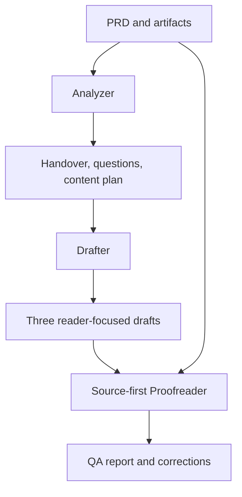

# Technical writing case study

This repository contains the three Tasket Tracks case-study deliverables and a reusable Codex workflow for producing first drafts from a different PRD. The source is a working specification, so the outputs distinguish documented facts from assumptions, unknowns, and contradictions.

## Start here

| Assignment part | Review |
| --- | --- |
| 1. Clarifications and assumptions | [Register](output/tracks/analysis/clarifications-and-assumptions.md), [evidence handover](output/tracks/analysis/HANDOVER.md), [content scope](output/tracks/analysis/CONTENT-PLAN.md) |
| 2. Three documents | [Feature guide](output/tracks/feature/feature-guide.md), [how-to](output/tracks/how-to/how-to.md), [release note](output/tracks/release-note/release-note.md) |
| 3. Reusable skill | [Generate docs](.agents/skills/generate-docs/SKILL.md), [live-round guide](demo/README.md) |
| Review status | [QA report](output/tracks/qa/QA-REPORT.md) |

The Tracks PDF is [the authoritative source](input/Technical%20Writer%20-%20Case%20Study.pdf). In particular, page 3 says disabling Tracks hides data and restores it later, while page 5 says disabling clears assignments and statuses. [Q01](output/tracks/analysis/clarifications-and-assumptions.md) keeps both statements unresolved. The three reader-facing drafts omit the disputed outcome.

## How the workflow works



The Analyzer establishes a documentation contract. The Drafter uses that contract to serve three different reader goals. The Proofreader checks both the contract and the drafts against the original source. `AGENTS.md` holds repository-wide evidence rules; the four skills under `.agents/skills/` hold stage-specific instructions.

## Output structure

Each run creates a separate `output/<feature-slug>/` tree:

| Folder | Files and purpose |
| --- | --- |
| `analysis/` | `HANDOVER.md` (classified claims), `clarifications-and-assumptions.md` (open questions), `CONTENT-PLAN.md` (CREATE / UPDATE / DEFER scope) |
| `feature/` | `feature-guide.md` for a first-time user |
| `how-to/` | `how-to.md` for one supported user goal |
| `release-note/` | `release-note.md` for an existing user scanning the change |
| `qa/` | `QA-REPORT.md` with source-first findings and readiness |

Reusable structures live in `templates/`. A run may use descriptive filenames inside the same folders when several topics of a type are requested. The default three-document run creates one of each.

## Run it in Codex CLI

From the repository root in Codespaces, open Codex and enter:

```text
Read .agents/skills/generate-docs/SKILL.md and run it on input/Technical Writer - Case Study.pdf. Write to output/tracks/. Read all pages, including tables. Keep contradictory disable behavior unresolved. Report the content scope and QA result.
```

For a new PRD, place it under `input/` with a distinct name and replace the two paths in that prompt. Use a new output slug so the Tracks files are preserved. Codex discovers repo-local skills in `.agents/skills/`; `$generate-docs` can also invoke the master skill. See [the rehearsal guide](demo/README.md) for a different PRD and a live skill edit.

## Checks and limits

```text
python3 scripts/check_outputs.py output/tracks
```

The checker catches missing files/headings, broken local links, placeholders, and unmatched claim/question IDs. It does not establish whether a product claim is true. The Proofreader compares the source, handover, scope, and drafts, records PASS/WARNING/FAIL findings, and separates assignment review from publication readiness. No product build or existing Tasket documentation was supplied; proposed updates to existing help content remain candidates until that content is inventoried.

Download this branch as a ZIP from GitHub if a single folder is needed for submission. The [live-round guide](demo/README.md) gives a prompt and verification sequence for a different PRD.
