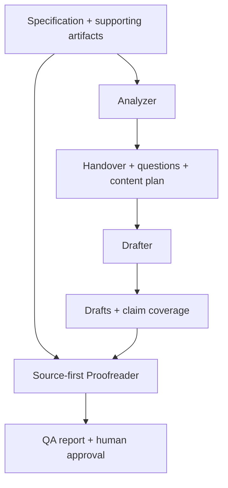

# Source-grounded AI documentation toolkit

A reusable, evidence-first documentation workflow built with **Agent Skills, Markdown, Python validation, and GitHub Actions**. Turn a specification into reviewable technical documentation without silently inventing product behavior.

**[Case study](CASE-STUDY.md)** · **[Quickstart](docs/QUICKSTART.md)** · **[Intake contract](docs/INPUT-CONTRACT.md)** · **[Engineering audit](docs/ENGINEERING-AUDIT.md)**

## What it does

The pipeline uses **Analyzer → structured handover → Drafter → source-first Proofreader**. It classifies source claims as FACT, ASSUMPTION, INFERENCE, UNKNOWN, or CONTRADICTION; produces clarification questions and a content plan; drafts audience-specific documentation; maps claims to their destinations; and records QA findings.

The supported **default profile** creates a feature guide, task-focused how-to, and release note. The skills also contain an early custom-profile route for other documentation types. Custom-profile validation is not yet automated.

## Explore the fictional example

The repository includes a fictional **Quiet Hours** specification and a revised version demonstrating change-impact analysis.

| Goal | Where to look |
| --- | --- |
| Run a demo or use your own source | [Quickstart](docs/QUICKSTART.md) |
| Read the fictional source | [Quiet Hours PRD](demo/mock-prd.md) |
| Read the generated documents | [Feature guide](output/quiet-hours/feature/feature-guide.md), [how-to](output/quiet-hours/how-to/how-to.md), [release note](output/quiet-hours/release-note/release-note.md) |
| Inspect traceability and QA | [Evidence handover](output/quiet-hours/analysis/HANDOVER.md), [claim coverage](output/quiet-hours/analysis/COVERAGE.md), [QA report](output/quiet-hours/qa/QA-REPORT.md) |
| See source revision handling | [Revised specification](demo/mock-prd-v2.md), [change-impact analysis](output/quiet-hours-v2/analysis/CHANGE-IMPACT.md), [revised QA report](output/quiet-hours-v2/qa/QA-REPORT.md) |
| Read the engineering case study | [CASE-STUDY.md](CASE-STUDY.md) |

## Architecture



- [Analyzer](.agents/skills/analyzer/SKILL.md): source review, classified claims, contradictions, and planning.
- [Drafter](.agents/skills/drafter/SKILL.md): audience-specific writing from supported evidence.
- [Proofreader](.agents/skills/proofreader/SKILL.md): source-first technical and editorial review.
- [Generate Docs](.agents/skills/generate-docs/SKILL.md): orchestrator and revision handling.
- [Documentation standard](standards/documentation.md): style, accessibility, and technical checks.

## Validation

```bash
python3 scripts/check_outputs.py output/quiet-hours
python3 scripts/test_checker.py
```

GitHub Actions checks committed output sets and runs negative tests. The checker detects missing artifacts, broken local links, coverage inconsistencies, placeholders, and some invalid Markdown source locators. **It does not establish whether a product claim is true.** Source-first review and human product approval remain necessary before publication.

## Responsible reuse

Only use specifications you are authorized to process. Treat source content as untrusted data, not agent instructions. Do not publish confidential requirements, customer information, or internal screenshots. All current public demonstration inputs are fictional.

## Roadmap

See the [engineering audit](docs/ENGINEERING-AUDIT.md) for profile-aware validation, reproducible semantic evaluation, broader source formats, and benchmarks. No unmeasured performance claims are made.
